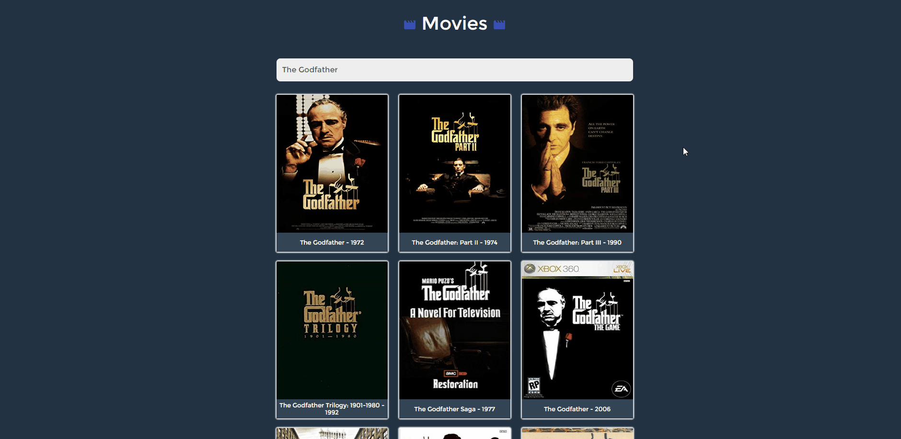
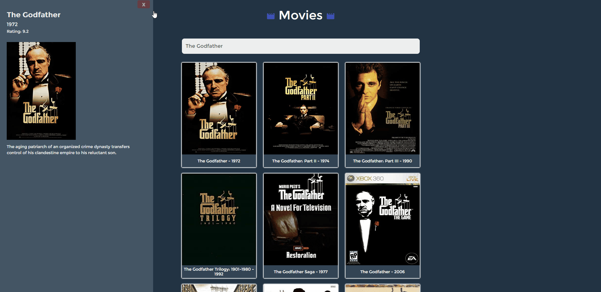
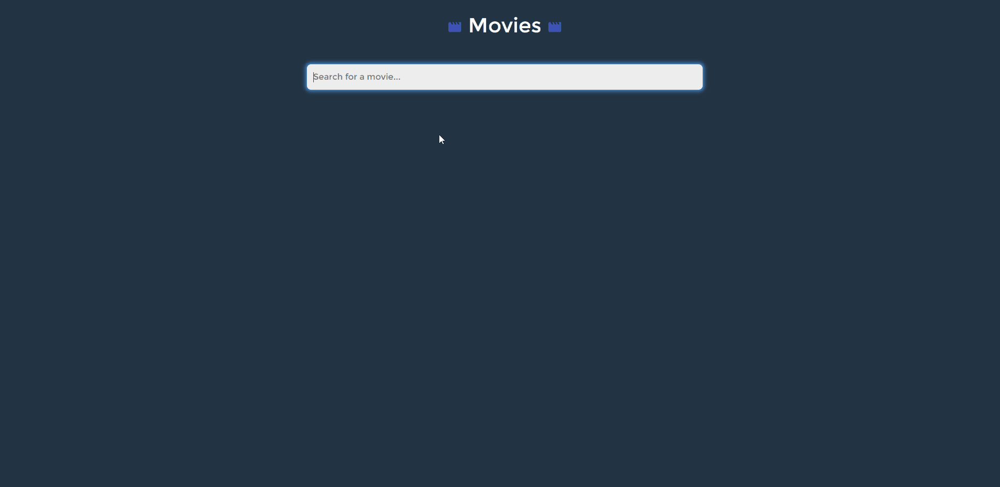

# Movie application


 It's a simple movie app, where you can find the movies. With the given movie name, the application refers to MovieAPI.

## Requirements

```bash
# You have to create file with API Key in main folder 
touch .env
```


```bash
# In '.env' file you have to add Api Key
REACT_APP_API_KEY=
```

## How to run

```bash
# Install essentials dependencies
npm install

# Start application
npm start

# Start application on specific port
npm start --port 8000

```


 ## Used technologies
 * React.js
 * Bootstrap

 ## Used API
 http://www.omdbapi.com/

## Usage
<p align="center">



</p>


